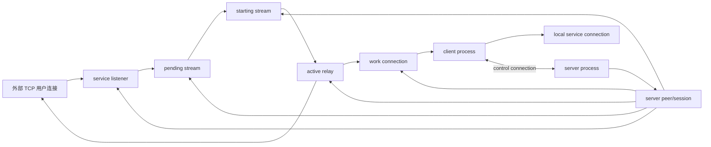

# 并发模型与生命周期审计

本文记录 ctunnel 第一阶段 TCP 隧道的真实对象模型、所有权和关闭路径。当前实现保持单线程、非阻塞事件循环；Linux 使用 epoll，macOS/BSD 使用 kqueue，便携后端和 Windows 使用 poll/WSAPoll。没有运行时第三方事件库。

## 对象关系

## 主要对象

| 对象 | 创建位置 | 所有者 | 引用关系 | 正常关闭 | 错误/超时关闭 |
|---|---|---|---|---|---|
| control connection | client `ct_net_connect()`；server incoming 完成握手后迁入 peer | `ct_control`，client session 或 server peer | 绑定 session keys、client_id、heartbeat 时间 | 收到 GOAWAY、进程退出 | heartbeat timeout、控制帧非法、认证失败 |
| incoming connection | server control listener accept 后 | server `incoming[]` | fd + handshake 临时态 + remote 地址 | 认证完成迁入 peer，或 work bind 迁入 peer work pool | handshake timeout、首帧非法、单来源/全局 incoming 上限 |
| work connection | client `ct_work_connect()` 主动建立 | idle 时为 client `work[]` / server peer `work[]`；assigned 后进入 starting/relay | 带 session 绑定的 32 字节 work id | 被 START_STREAM 消费后进入 relay；协议不复用该 work | bind 认证失败、control 断开、stream 建立失败 |
| service listener | client 注册服务后 server bind | server peer `svc[]` | 指向对应 service config | peer 关闭时全部关闭 | listener 冲突、bind 失败、control 断开 |
| pending stream | service listener accept 外部连接后 | server peer `pending[]` | fd + service 指针 + deadline | 被 FIFO 取出并分配 work | pending timeout、stream/client/service 上限、peer 关闭 |
| starting stream | pending + work 配对，已发送 START_STREAM | server peer `starting[]` | pending fd + work fd + stream_id + random | 收到 STREAM_READY 后迁入 relay | READY 超时/失败/迟到非法 |
| active relay | START_STREAM/READY 成功后 | `ct_relay` slot | direct fd + work fd + 双向 ring buffer + DATA AEAD 状态 | 双向 EOF 且 buffer drain 完成 | AEAD 失败、send/recv 致命错误、peer/session 关闭 |
| local service connection | client 收到 START_STREAM 后连接 local_addr/local_port | client relay direct fd | 与 work fd 成对 | relay close | local connect timeout/fail |
| event registration | 每轮 event_loop_create 后重建 | 当前循环栈/heap refs | user 指针指向 peer 或 fd 再查表 | event loop destroy | stale event 通过 fd 查表或 closed 标志忽略 |
| timer/deadline | monotonic ms 字段 | 对象自身 | incoming/pending/starting/control heartbeat | 到期后当前循环清理 | control 断开时 peer_close 批量清理 |
| buffer | relay init 时固定 ring | relay | to_direct、to_work；DATA 加密时另有 work_input | relay close free | AEAD 失败立即 close 并清理 |

## 所有权原则

- control fd 在认证前属于 `incoming[]`；认证成功后属于 `server_peer.ctl`。
- work fd 在认证前属于 `incoming[]`；bind 成功后属于 `server_peer.work[]`；被分配后属于 `starting[]`；relay 建立成功后属于 `ct_relay`。
- service listener 的 fd 只属于注册该服务的 server peer；peer 关闭时统一释放。
- pending fd 在 `pending[]` 和 `starting[]` 间移动，任何时刻只属于一个数组元素。
- relay 一旦接管 fd，其他数组不再关闭它；relay close 是 active stream 的唯一关闭入口。
- control 断开时 `peer_close()` 关闭该 session 下 listeners、idle work、pending、starting、relays，并擦除 session keys。旧 session 的 work bind 因 session_id 查找失败而拒绝。

## 事件与 stale event 防护

当前主循环每轮重建 event backend 和 refs；refs 生命周期只覆盖本轮 `event_loop_wait()` 返回的一批事件。对于 incoming、idle work、starting 等会被 swap-remove 的数组，事件 user data 只保存 fd，处理时重新按 fd 查找当前对象；找不到说明对象已被同轮其它事件关闭，安全忽略。relay 使用 `closed` 标志防重复 close。

后续若改成长生命周期 event loop，应为所有对象增加 `unique_id/generation`，并在 timer/event user data 中携带 generation，防止 fd 复用误投递。

## 缓冲与背压

每个 relay 使用固定大小 ring buffer，不做无界 realloc。事件兴趣遵循：

- 目标方向 buffer 有数据才开启 WRITE。
- 源方向输出 buffer 接近满时暂停 READ。
- DATA 加密时，密文输入 `work_input` 与明文输出 `to_direct` 分离；完整 record 才解密。
- 半关闭不会立即丢弃反方向数据；先 flush 剩余 buffer，再 `shutdown(SHUT_WR)`。
- 大响应场景中，direct 侧 flush 后会再次 drain `work_input`，避免加密 record 卡在内部缓冲。

## 已知限制

- 当前 timer 是有界数组线性扫描，适合当前编译期上限；若目标稳定支撑数千到上万连接，应改为小顶堆或时间轮。
- active stream/service 查找仍以有界数组扫描为主；1000 级别可接受，数万级需要固定桶或开放寻址表。
- work pool 是 idle 预连接池，work 连接承载一个 stream 后关闭，不复用旧 buffer。
- 暂无 HTTP dashboard；本阶段只提供内部 metrics 计数并在进程退出/重连时输出日志快照。
- 不实现 UDP、Proxy Protocol、HTTP/HTTPS、MUX、QUIC/KCP。
